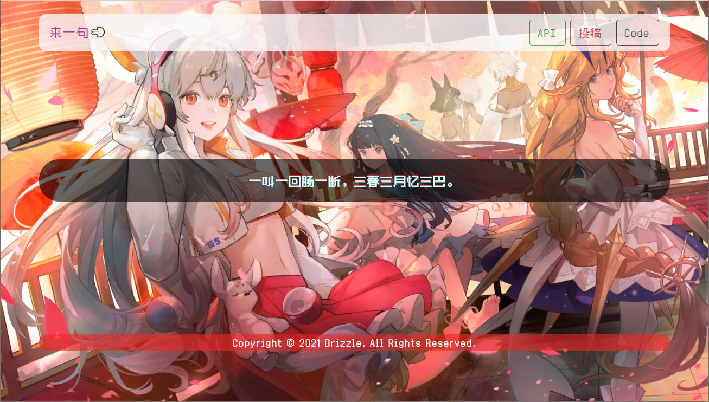
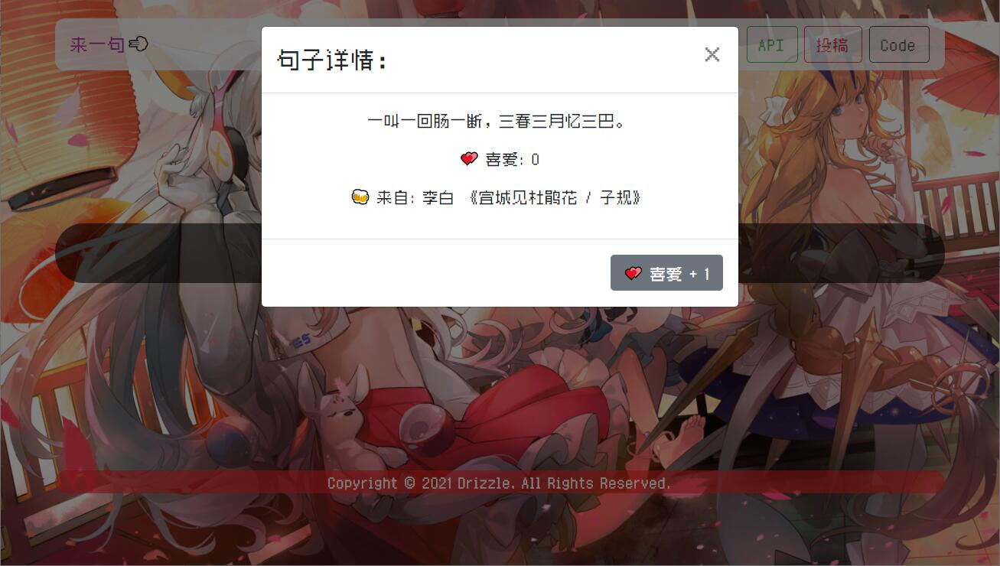
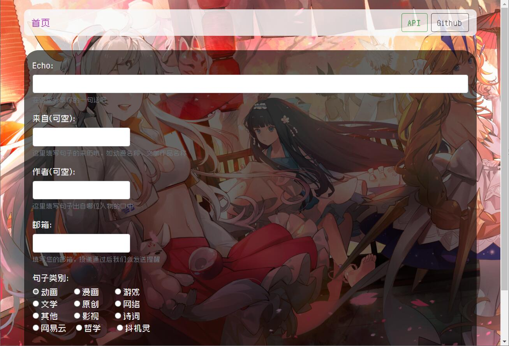

# Echo
>这是一个前后端分离的 PHP 一言程序  
>演示地址：https://echo.drizzle.vip

Echo，来到这里，留下你所喜欢的那一句句话吧

技术栈：  

`Html5` `JavaScript` `CSS3` `PHP` `MySQL`

后端PHP需要8.0以上版本，本程序使用了较多的PHP8的新特性！

### 图片演示：

### 现有功能：  
* 一句话显示  
* 投稿  
* API接口

### 后期设想：  
* 社区化（评论，收藏）  
* 多元化（语音，图片）